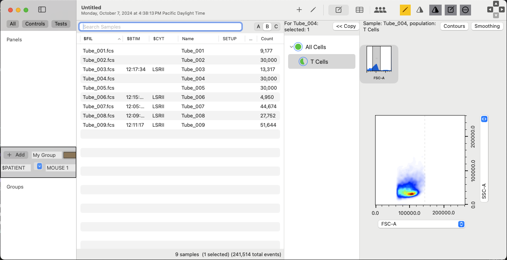

#  Cytegeist 

SwiftUI Data analysis for flow cytometry files (FCS)

----
Most of the domain specific code is in *Core*

The primary model object is **Experiment** 
It contains a list of **Samples** 

**Samples** have a URL to the data file 
They have a **meta** dictionary containing ~100 keyword-value pairs 
    
A Sample contains an AnalysisNode called **tree** 
AnalysisNodes have a list of **children**, which are also AnalysisNodes 
    
Each AnalysisNode contains one **gate**, which is the predicate applied to its parent to yield a population
    
Currently gates, are geometric regions in one or two dimensions, but any function on a population is a **gate** 
    
Each AnalysisNode has one **ChartDef**, which describes how to display the population 

----
The main view object is the **ExperimentView** 

It contains a **Sidebar**, **SampleList**, **AnalysisList** & **ReportPanel**   
The **ReportPanel** is toggled between **GatingView**, **CGTableView** and **CGLayoutView** 
